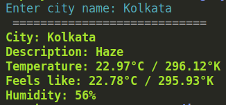
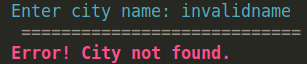

# CLI Weather App

An easy to use command-line weather app using Python and [OpenWeatherMap API](https://openweathermap.org/).

<hr>

## Installation
1. Download the source code.

2. Go to the folder directory and run:
```
pip install -r requirements.txt
```

## Usage
1. Run:
```
py main.app
```
2. Enter the city name.

## Preview

<br>
