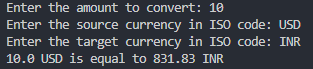

# Currency Converter
>💰 A command-line tool written in Python to convert between currencies.

<div align='center'>
    
</div>

## ISO codes
A list of Country currency codes can be found <a href='https://www.iban.com/currency-codes' target='_blank'>here.</a>

## Installation
1. Download the folder `CurrencyConverter`
2. Run the command to install dependencies
```:
pip install -r requirements.txt
```
3. Execute the main file
```
py main.py
```