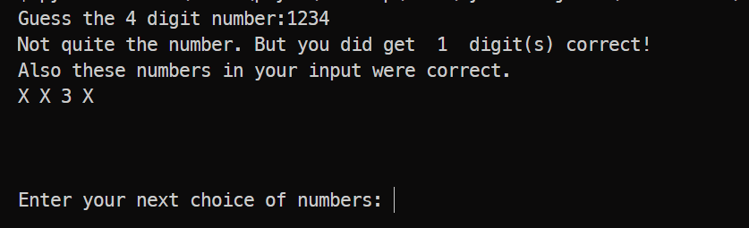

# Mastermind Game

A fun game to test your guessing powers. Guess the 4 digits number in less guesses as possible. The digits will be revealed as soon as you guessed it correctly.

## How to Play

1. 4 digit secret number is generated.
2. You need to guess the number.
3. After each guess, you get a feedback:
   - The number of digits you guessed correctly in their exact positions.
   - The number of digits you guessed correctly but in the wrong positions.
4. use this feedback to reach to the exact faster.

## Running the Game
   ```
   python mastermind.py
   ```

## Snapshots
- 

- 