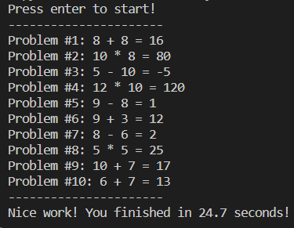

# Timed Math Challenge

This simple Python script is an arithmetic quiz game that generates random arithmetic problems for the user to solve. The user is prompted to input their answer for each problem, and the script provides feedback on the correctness of the answer. The quiz concludes with a summary of the total time taken.


## How to Run

```
python TimedMathChallenge.py
```

## Snapshot 

