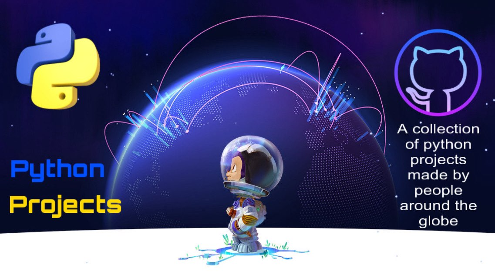

# PythonProjects

Welcome to PythonProjects, a repository filled with exciting and educational Python projects suitable for developers of all levels. Whether you're a beginner embarking on your Python journey or an intermediate developer seeking to enhance your skills, this collection has something for everyone!

## Table of Contents

- [Beginner Level Projects](#beginner-level-projects)
  - [Rock Paper Scissors](#rock-paper-scissors)
  - [Hangman](#hangman)
  - [Caesar Cipher](#caesar-cipher)
  - [Blackjack](#blackjack)
  - [Password Generator](#password-generator)
  - [Guess the Number](#guess-the-number)
  - [Vigenere Cipher](#vigenere-cipher)
  - [Modified Vigenere Cipher](#modified-vigenere-cipher)
  - [Tic Tac Toe](#tic-tac-toe)
  - [Typing Speed and Accuracy Test](#typing-speed-and-accuracy-test)
  - [Memory Tiles](#memory-tiles)

  - [Intermediate Level Projects](#intermediate-level-projects)
  
  - [Screen Recorder](#screen-recorder)
  - [Timed Math Challenge](#timed-math-challenge)
  - [Mad Libs](#mad-libs)
  - [Image to Pencil Sketch Generator](#image-to-pencil-sketch-generator)
  - [Car Game](#car-game)
  - [CLI-Weather App](#cli-weather-app)
  - [Mini Wikipedia App CLI](#mini-wikipedia-app-cli)

  
- [Intermediate Level Projects](#intermediate-level-projects)

  - [Snake Game](#snake-game)
  - [Pong Game](#pong-game)
  - [Quiz Game](#quiz-game)
  - [Type Speed Test](#type-speed-test)
  - [Turtle Crossing Game](#turtle-crossing-game)
  - [Hirst Painting Generator](#hirst-painting-generator)
  - [Coffee Machine Simulator](#coffee-machine-simulator)
  - [Num Sherlock](#num-sherlock)
  - [Drowsiness Detection](#drowsiness-detection)
  - [Mastermind Game](#mastemind-game)
  - [Sudoku](#sudoku)
  - [Space Invaders](#space-invaders)
  - [Socket Communication](#socket-communication)

## Beginner Level Projects

### :rock: Rock Paper Scissors
Challenge the computer to a classic game of rock-paper-scissors and test your luck. Simple yet entertaining for a quick gaming break.

### 💀Hangman
Guess the word before the stick figure is fully drawn! A perfect project for practicing loops and conditionals.

### 🔐Caesar Cipher
Explore the world of cryptography by encrypting and decrypting messages using the famous Caesar Cipher. A beginner-friendly introduction to the fascinating field of code-breaking.

### Blackjack
Experience the thrill of the casino with a simple text-based Blackjack game. Perfect for learning about game logic and conditional statements.

### 🛡️Password Generator
Ensure your online security with a custom password generator. Create strong and secure passwords effortlessly.

### 🤔Guess the Number
Challenge the computer to pick the correct number within a limited range. Test your guessing skills with this number-guessing game.

### 🔐Vigenere Cipher
Delve deeper into cryptography by encrypting and decrypting messages using the Vigenere Cipher. A great project for cryptography enthusiasts.

### 🔐Modified Vigenere Cipher
Take on the challenge of encrypting messages using a modified Vigenere Cipher. A fun project for those who love puzzles and cryptography.

### 🔴Tic Tac Toe
Enjoy a classic game of Tic Tac Toe with friends. A simple and lightweight game suitable for any machine.

### ⌨️Typing Speed and Accuracy Test
Sharpen your typing skills with a speed and accuracy test. Practice file handling and string manipulation while improving your typing proficiency.

### 💿Memory Tiles
Test your photographic memory with this nostalgic game of matching pairs of tiles. Learn tkinter for GUI and game logic in Python.

### 🎥Screen Recorder
This is a simple Python script that can record your screen to a video file. 

### 📝Timed Math Challenge
This simple Python script is an arithmetic quiz game that generates random arithmetic problems for the user to solve.

### Mad Libs
This Python script generates amusing and random stories using the Mad Libs format.

### 🖋Image to Pencil Sketch Generator
This program allows you to convert any image into a pencil sketch. A simple program which uses OpenCV.

### 🎮Car Game
A simple python game that gets you ready for a safe drive on road by avoiding collisions.

### CLI-Weather App
An easy to use command line weather app using Python, using the power of APIs.

### Mini Wikipedia App CLI
This is a simple program which utilizes the MediaWiki API to retrieve information such as page content, links, URLs, and more.

## Intermediate Level Projects

### 🐍Snake Game
Take a trip back to the retro gaming era with a classic Snake Game. Dive into event-driven programming and user input handling.

### Pong Game
Test your reflexes with a classic Pong game. Explore game physics and collision detection in this timeless project.

### Quiz Game
Create and play quizzes with a simple quiz game. Dive into file handling and user interaction in this educational project.

### Type Speed Test
Challenge yourself with a typing speed test. Choose your difficulty level and start typing! The project is based on a simple GUI using tkinter.

### Turtle Crossing Game
Embark on a mini-game adventure in Python, incorporating OOP and the Turtle module. Help a turtle cross the street safely.

### Hirst Painting Generator
Create mesmerizing Hirst-inspired paintings with random color patterns. Explore the world of turtle graphics and artistic programming.

### Coffee Machine Simulator
Simulate a coffee machine with customizable drink options. Perfect for practicing object-oriented programming and user interfaces.

### Num Sherlock
Engage your mind with a number-based game featuring Sherlock Holmes. Learn GUI with pygame, game logic, and conditional statements.

### Drowsiness Detection
Detect drowsiness by analyzing eyes and receive alerts. Enhance your understanding of computer vision with this valuable project.

### Mastemind Game
A fun game to test your guessing powers. Guess the 4 digits number in less guesses as possible. Digits will be revealed as soon as you guessed it correctly.

### Sudoku
Embark yourself in a Sudoku quest. Perfect for learning object-oriented programming, GUI with pygame, backtracking and conditional statements.

### Space Invaders
A fun game of spaceships and spacewars!! Eliminate the enemies or you die ;) This is a perfect project for learning pygame module and game logic.

### Socket Communication
A project that showcases a basic Python socket communication setup for client-server interaction. The primary objective is to facilitate communication between a server and client nodes.

### Ice-cream parlour
a e-commerce site made with django framework for selling icecream.

##🔥 Stats 🔥
 
 

 ## Thanks to all the contributors 🔥🔥!!!

## 🔥Contributing🔥:::

We invite and encourage contributions from the community! Whether you want to add a new project, improve existing code, or fix a bug, your contributions are invaluable. 

To contribute:

1. Fork the repository.
2. Create a new branch for your feature or fix: `git checkout -b feature-name`.
3. Make your changes and commit them: `git commit -m 'Description of changes'`.
4. Push to your branch: `git push origin feature-name`.
5. Open a pull request on GitHub.

For details please also see [Contributing.md](contributing.md)

Let's build and learn together! Happy coding!
