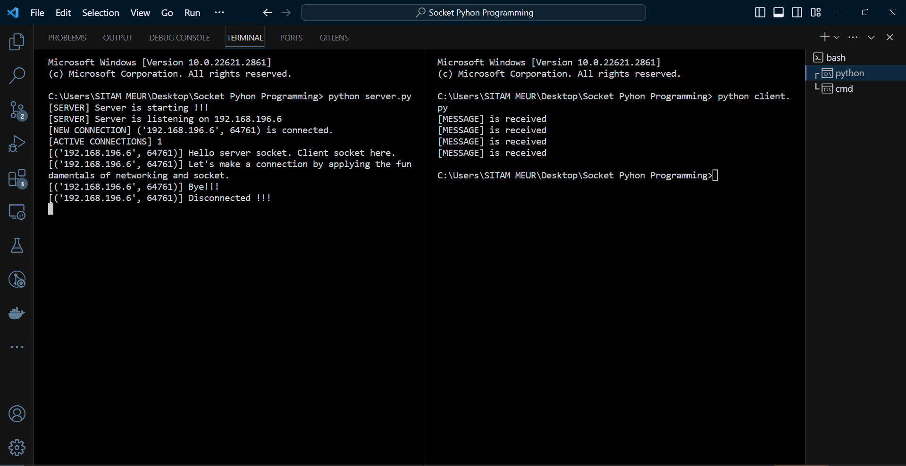
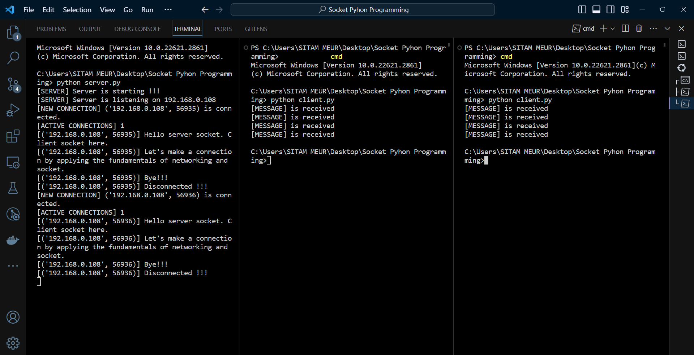

# Python Socket Communication Setup

## Overview

This project showcases a basic Python socket communication setup for client-server interaction. The primary objective is to facilitate communication between a server and client nodes.

## Server Side

1. Create a server socket.
2. Bind it to a specified IP and port.
3. Listen and accept incoming client connections.
4. Handle communication with connected clients.
5. Close the server socket when done.

## Client Side

1. Create a client socket.
2. Connect to the server using the server's IP and port.
3. Send requests or data to the server.
4. Close the client socket when communication is complete.

## Execution

1. Ensure you have Python installed. This project is compatible with Python 3.6 and above.
2. Set up a Python virtual environment: `python -m venv myenv`.
3. Activate the virtual environment:
   - On Windows: `myenv\Scripts\activate`.
   - On macOS and Linux: `source myenv/bin/activate`.
4. Install the required Python version mentioned in [requirements.md](requirements.md).
5. Run the server script: `python server.py`.
6. Run the client script: `python client.py`.

## Results

The server and client scripts should run without any errors. The server script should display the following output:

Server and client connection established.

Multiple clients can connect to the server at the same time.

## Conclusion

This project provides a straightforward example of setting up a Python socket communication system. You can adapt and modify the scripts to suit your specific requirements.
